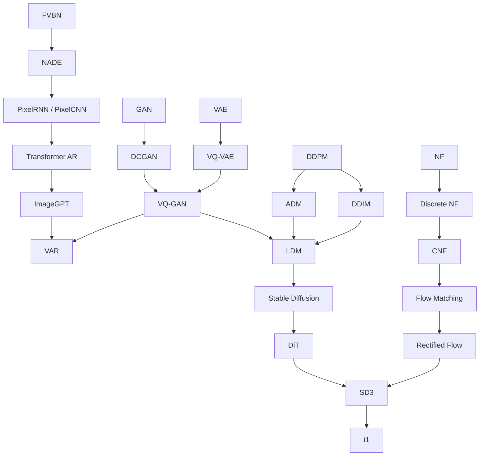

# AGENTS.md

This file documents the project rules for AI agents working in this repository. The goal is that an agent shouldn't have to guess — when something isn't covered here, ask the user directly.

## Project nature

This is a **personal learning project**, not a production project. The goal is to understand generative models — both the theory and the engineering — by implementing them from scratch, not to produce a maintainable framework or library.

Therefore:

- Keep code simple — **no over-engineering**: no premature abstraction, no config options/flags for scenarios that "might be needed later," no error handling or input validation for cases that can't happen. Three lines of duplication beat one premature abstraction.
- Don't aim for production-grade robustness, generality, or backward compatibility.

## Rules for working with agents

1. **When unsure, ask — don't guess.** For naming, design choices, roadmap ordering, or anything else this file doesn't spell out, ask the user directly instead of assuming and proceeding.
2. **Default to proposing, not editing.** When the user asks a question or is just discussing something, explain what you'd change and where first, and only make the edit once they explicitly say to (e.g. "go ahead," "yes do that") — unless they've directly asked you to implement or modify something. Even requests that sound implementation-directed ("give me the code," "show me the implementation") default to an in-chat explanation (which may include full code) — not a file write. Treat only language that explicitly targets the repo/files (e.g. "write it to the file," "implement this in the repo") as authorization for Edit/Write.
3. Treat the repo's actual current contents as the source of truth for progress (e.g. what's already in `numpy_impl/models/`). This file doesn't track a progress list and doesn't need to be kept in sync with every change.

## Learning roadmap

A hand-drawn learning map of generative models. Arrows represent conceptual prerequisites. The five tracks are fairly independent, so branches can be tackled in any order — strict topological order isn't required (e.g. starting the VAE track before the autoregressive track is fine).

The five tracks:

- **Autoregressive**: FVBN → NADE → PixelRNN/PixelCNN → Transformer AR → ImageGPT
- **GAN**: GAN → DCGAN
- **VAE**: VAE → VQ-VAE
- **Diffusion**: DDPM → ADM / DDIM → LDM → Stable Diffusion → DiT
- **Flow**: NF → Discrete NF → CNF → Flow Matching → Rectified Flow
- **Convergence**: DCGAN + VQ-VAE → VQ-GAN; ImageGPT + VQ-GAN → VAR; VQ-GAN + ADM/DDIM → LDM; DiT + Rectified Flow → SD3 → i1

## Implementation methodology: numpy → C → CUDA

**Progress per model**: take one model all the way through numpy → C → CUDA before starting the next model on the roadmap. Don't implement numpy for every model first and circle back for C/CUDA later.

1. **numpy** (`numpy_impl/`): plain numpy + stdlib, to verify the algorithm itself is correct. Performance isn't the point.
2. **C** (`c_impl/`): hand-write tensors and memory management, to understand what numpy hides underneath (memory layout, loops, numerical details).
3. **CUDA** (`cuda_impl/`): hand-write CUDA kernels to port the C version to the GPU, to understand parallel computing. **"Going to GPU" means hand-written kernels, not switching to a high-level CUDA backend like PyTorch's** — libraries like cuBLAS/cuDNN can be used where it makes sense, but the goal is implementing the ops yourself, not just calling a library.

**Depth of coverage (current strategy, subject to change):** prioritize taking the roadmap's most important nodes fully through numpy→C→CUDA. For the rest — variant/branch nodes like ADM vs. DDIM, DCGAN, etc. — don't assume whether they need all three implementations. Decide that later, once the shared low-level modules (tensor, optimizer, trainer, etc.) and understanding of the model in question have matured. Don't unilaterally decide whether a given node needs a C/CUDA implementation — ask the user.

If PyTorch-related code or artifacts show up in the repo (e.g. `checkpoints/vae.pt`), they're a transitional reference, not a long-term implementation — don't build on them or treat them as the source of truth.

## Repository layout

- `numpy_impl/`: the numpy reference implementation — `models/`, `modules/`, `optimizer/`, `data.py`, `trainer.py`, `train.py`.
- `c_impl/`: the C implementation. Both `include/` and `src/` are layered as `core/ data/ models/ modules/ optimizers/ tools/ trainer/`; `third_party/` holds vendored single-file libraries (cJSON, stb_image_write).
- `cuda_impl/`: the CUDA implementation. Currently empty; expected to mirror `c_impl`'s directory structure.
- `configs/`: JSON configs (dataset / model / optimizer / training / sampling / checkpoint).
- `data/`, `samples/`, `checkpoints/`, `build/`: local artifacts, already excluded via `.gitignore` — not committed.

## Environment

- conda environment naming: `{project}_{GPU vendor}_{CUDA version}_{python version}`. The GPU/CUDA segments describe **this machine's hardware**, not what's actually installed in the environment.
- Package install flow: after `conda create` sets up the environment, always install libraries with `<env>/bin/uv pip install --python <env>/bin/python <pkg>`. `uv tool install` is only for installing CLI tools (e.g. ruff) — never use it for libraries that need to be imported, since it installs into an isolated directory that won't be importable.
- Don't install torch or CUDA pip packages in the environment. Add GPU-related dependencies only once CUDA work actually starts, and only as needed (NVIDIA driver, CUDA Toolkit, cuBLAS/cuDNN if needed).
- Invoke the Python interpreter by absolute path — don't rely on wherever bare `python` happens to resolve.
- The C build uses CMake + Ninja (`cmake -G Ninja -B build && cmake --build build`, see [CMakeLists.txt](CMakeLists.txt)). When `cuda_impl/` gets real sources, add a CUDA target there rather than restructuring the existing one.

## Code style

- numpy side: classes with `forward`/`backward` methods; constructors and calls make heavy use of keyword arguments (e.g. `Linear(in_dim=..., out_dim=..., rng=...)`); essentially no comments or docstrings.
- C side: `struct`s + free functions (`vae_alloc` / `vae_forward` / `vae_backward` ...); intermediate results are passed via a workspace struct; functions return an `int` error code.
- Both sides keep this style: no comments by default — only write one when a non-obvious "why" is worth a line.
