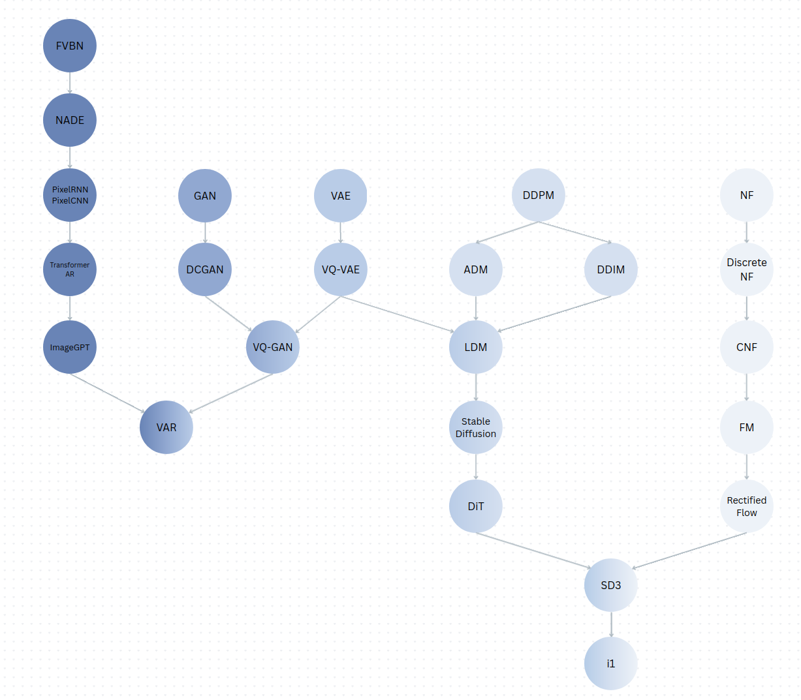

# Generative Models, From Scratch

A learning project that works through generative models from first principles, no ML frameworks involved. Each model on the roadmap gets implemented up to three times, in increasing order of how much a framework normally hides from you:

1. **NumPy** (`numpy_impl/`) — get the algorithm itself right
2. **C** (`c_impl/`) — hand-written tensors and memory management
3. **CUDA** (`cuda_impl/`) — hand-written GPU kernels

See [AGENTS.md](AGENTS.md) for the full methodology and project rules.

## Roadmap



## Project layout

```
numpy_impl/     NumPy reference implementations
c_impl/         C implementations
cuda_impl/      CUDA implementations
configs/        JSON training configs
data/           datasets
```

## Setup

### Environment

Needs conda (or miniconda) and a C compiler.

```bash
git clone https://github.com/sIlENtbuffER/Generative-Models.git
cd Generative-Models
conda env create -f environment.yml
conda activate genmodels_NV_CU130_py312
```

`environment.yml` pulls in `gcc_linux-64`, which targets Linux x86-64. On macOS or Linux ARM, swap that line before creating the env:

```bash
# macOS (Intel)
sed 's/gcc_linux-64/clang_osx-64/' environment.yml > /tmp/environment.yml && conda env create -f /tmp/environment.yml

# macOS (Apple Silicon)
sed 's/gcc_linux-64/clang_osx-arm64/' environment.yml > /tmp/environment.yml && conda env create -f /tmp/environment.yml

# Linux ARM (aarch64)
sed 's/gcc_linux-64/gcc_linux-aarch64/' environment.yml > /tmp/environment.yml && conda env create -f /tmp/environment.yml
```

### Datasets

MNIST (grayscale, 28×28):

```bash
mkdir -p data/MNIST/raw
cd data/MNIST/raw
for f in train-images-idx3-ubyte train-labels-idx1-ubyte t10k-images-idx3-ubyte t10k-labels-idx1-ubyte; do
    curl -LO "https://ossci-datasets.s3.amazonaws.com/mnist/${f}.gz"
    gunzip "${f}.gz"
done
cd -
```

CelebA (color, 64×64):

```bash
mkdir -p data/CelebA
curl -L -r 0-250000000 -o data/CelebA/img_align_celeba.zip "https://huggingface.co/datasets/Yuehao/celeba/resolve/main/img_align_celeba.zip"
python scripts/prepare_celeba.py
```

JPEG decoding isn't worth hand-writing, so [`scripts/prepare_celeba.py`](scripts/prepare_celeba.py) does the preprocessing once with Pillow. It center-crops each image and resizes to 64×64, and writes `data/CelebA/celeba.bin` as a small header plus raw CHW `uint8` pixels. `COUNT` at the top of the script sets how many images to use; raise the byte range above it if you want more.

## Running

Both implementations take a JSON config path as their first argument — hyperparameters, dataset, and where to write samples/checkpoints — and fall back to [`configs/default.json`](configs/default.json) when none is given.

### NumPy

```bash
python numpy_impl/train.py configs/default.json
```

### C / CUDA

```bash
cmake -G Ninja -B build
cmake --build build
```

This always builds `./build/genmodels_train_c`. If a CUDA toolkit is available, it's picked up automatically and `./build/genmodels_train_cuda` is built alongside it.

```bash
./build/genmodels_train_c configs/default.json       # CPU
./build/genmodels_train_cuda configs/default.json    # GPU, if CUDA is available
```

## References

The paper behind each model on the roadmap, grouped by track.

**Autoregressive**
- FVBN — Frey, Hinton & Dayan, [Does the Wake-sleep Algorithm Produce Good Density Estimators?](https://papers.nips.cc/paper/1153-does-the-wake-sleep-algorithm-produce-good-density-estimators) (1995)
- NADE — Larochelle & Murray, [The Neural Autoregressive Distribution Estimator](https://proceedings.mlr.press/v15/larochelle11a.html) (2011)
- PixelRNN / PixelCNN — van den Oord, Kalchbrenner & Kavukcuoglu, [Pixel Recurrent Neural Networks](https://arxiv.org/abs/1601.06759) (2016)
- Transformer AR — Parmar et al., [Image Transformer](https://arxiv.org/abs/1802.05751) (2018)
- ImageGPT — Chen et al., [Generative Pretraining from Pixels](https://proceedings.mlr.press/v119/chen20s.html) (2020)

**GAN**
- GAN — Goodfellow et al., [Generative Adversarial Networks](https://arxiv.org/abs/1406.2661) (2014)
- DCGAN — Radford, Metz & Chintala, [Unsupervised Representation Learning with Deep Convolutional Generative Adversarial Networks](https://arxiv.org/abs/1511.06434) (2015)

**VAE**
- VAE — Kingma & Welling, [Auto-Encoding Variational Bayes](https://arxiv.org/abs/1312.6114) (2013)
- VQ-VAE — van den Oord, Vinyals & Kavukcuoglu, [Neural Discrete Representation Learning](https://arxiv.org/abs/1711.00937) (2017)

**Diffusion**
- DDPM — Ho, Jain & Abbeel, [Denoising Diffusion Probabilistic Models](https://arxiv.org/abs/2006.11239) (2020)
- ADM — Dhariwal & Nichol, [Diffusion Models Beat GANs on Image Synthesis](https://arxiv.org/abs/2105.05233) (2021)
- DDIM — Song, Meng & Ermon, [Denoising Diffusion Implicit Models](https://arxiv.org/abs/2010.02502) (2020)
- LDM / Stable Diffusion — Rombach et al., [High-Resolution Image Synthesis with Latent Diffusion Models](https://arxiv.org/abs/2112.10752) (2021)
- DiT — Peebles & Xie, [Scalable Diffusion Models with Transformers](https://arxiv.org/abs/2212.09748) (2022)

**Flow**
- NF — Rezende & Mohamed, [Variational Inference with Normalizing Flows](https://arxiv.org/abs/1505.05770) (2015)
- Discrete NF — Dinh, Krueger & Bengio, [NICE: Non-linear Independent Components Estimation](https://arxiv.org/abs/1410.8516) (2014)
- CNF — Chen et al., [Neural Ordinary Differential Equations](https://arxiv.org/abs/1806.07366) (2018)
- Flow Matching — Lipman et al., [Flow Matching for Generative Modeling](https://arxiv.org/abs/2210.02747) (2022)
- Rectified Flow — Liu, Gong & Liu, [Flow Straight and Fast: Learning to Generate and Transfer Data with Rectified Flow](https://arxiv.org/abs/2209.03003) (2022)

**Convergence**
- VQGAN — Esser, Rombach & Ommer, [Taming Transformers for High-Resolution Image Synthesis](https://arxiv.org/abs/2012.09841) (2020)
- VAR — Tian et al., [Visual Autoregressive Modeling: Scalable Image Generation via Next-Scale Prediction](https://arxiv.org/abs/2404.02905) (2024)
- SD3 — Esser et al., [Scaling Rectified Flow Transformers for High-Resolution Image Synthesis](https://arxiv.org/abs/2403.03206) (2024)
- i1 — Zeng et al., [i1: A Simple and Fully Open Recipe for Strong Text-to-Image Models](https://arxiv.org/abs/2606.11289) (2026)
